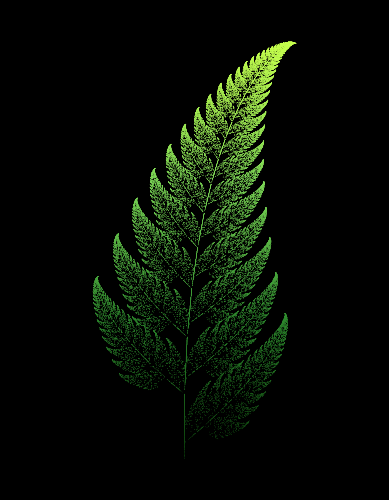
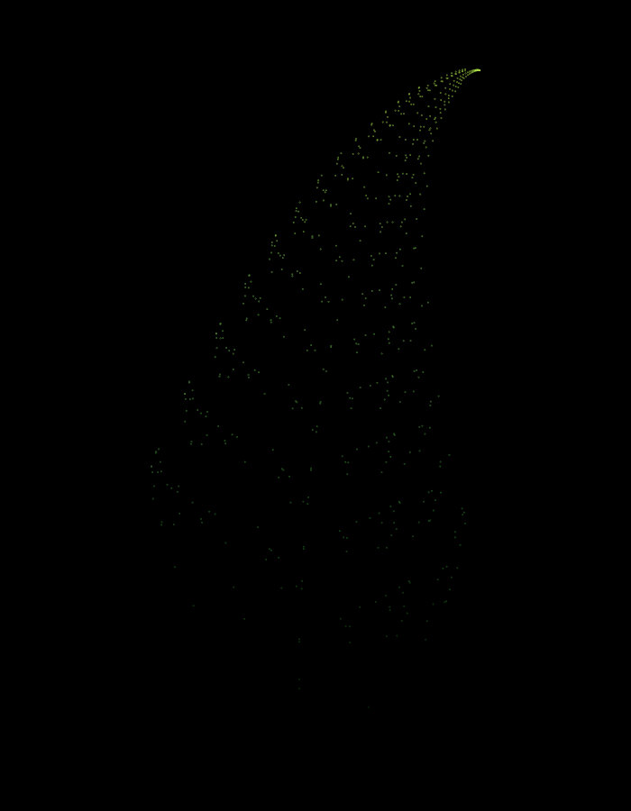

# Barnsley Fern - AI Lab

An animated Barnsley Fern generated in Python using the **chaos game**
(an Iterated Function System). The fern is drawn point-by-point with a
colour gradient from dark green at the base to yellow at
the tips, on a black background.





## Fractal Type Implemented

**Barnsley Fern** is a self-similar fractal produced by repeatedly
applying one of four randomly-chosen affine transformations to a
point, with probabilities tuned so the result resembles a real fern
(Michael Barnsley, 1988).

## Tools, Languages & Libraries Used

- **Python 3**
- **NumPy** - vectorised random transformation choices
- **Matplotlib** - rendering and animation (`FuncAnimation`)
- **FFmpeg** - encoding the growth animation to `.mp4`

## Setup & Run Instructions

```bash
git clone <this-repo-url>
cd barnsley-fern
pip install -r requirements.txt
python barnsley_fern.py
```

This produces:
- `fern_static.png` — final static render (screenshot above)
- `fern_growth.mp4` — animated growth (used for the demo video)
- `fern_growth.gif` — lightweight animated preview (shown above)

## How It Works

At each step, one of 4 affine transformations is applied to the
current point `(x, y)`:

| Transform | Probability | Role |
|---|---|---|
| f1 | 1% | Stem |
| f2 | 85% | Successively smaller leaflets |
| f3 | 7% | Left leaflet |
| f4 | 7% | Right leaflet |

Repeating this 60,000 times traces out the full fern shape. Colour is
mapped from each point's height (`y` value) onto a custom
green-to-lime gradient.

## Student Name and Registration Number

**Romaisa Kashif**

Registration No: 552737

BS Computer Science, NUST


